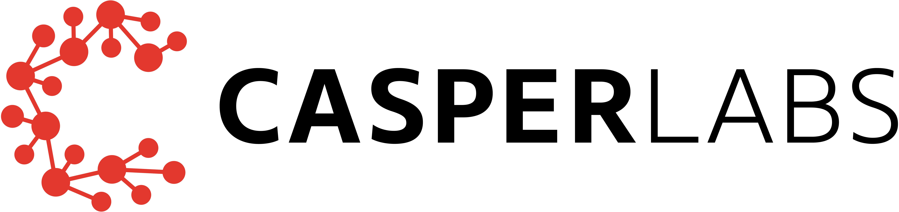

# `casper-contract`

[](https://casperlabs.io/)

[](http://drone-auto.casperlabs.io/CasperLabs/casper-node)
[](https://crates.io/crates/casper-contract)
[](https://docs.rs/casper-contract)
[](../../LICENSE)

A library for developing CasperLabs smart contracts.

## Compile-time features

The crate provides a `no-std` feature which is enabled by default.  It is recommended to use the library with this
default feature enabled to provide a `no_std` environment.  Compiling a Wasm smart contract with `no-std` enabled
generally yields a smaller, and hence cheaper, binary.

Given that the library is intended to be consumed by smart-contract binaries, and that in a no-std environment these
will all require to provide an [alloc error handler](https://github.com/rust-lang/rust/issues/51540) and an
[eh_personality](https://doc.rust-lang.org/unstable-book/language-features/lang-items.html#more-about-the-language-items),
then this crate provides these when `no-std` is enabled.  This unfortunately requires the use of nightly Rust.

For further convenience, the crate provides a global allocator suitable for use in a `no_std` environment via the
`provide-allocator` feature.  This is only valid if `no-std` is also enabled, and it is also enabled by default.  If you
wish to work in a `no_std` environment with a different global allocator, then add the following to your Cargo.toml:

```toml
casper-contract = { version = "1.0.0", default-features = false, features = ["no-std"] }
```

If you wish to work outside a `no_std` environment, then disable the default features and enable the `std` feature of
this crate.  For example:

```toml
casper-contract = { version = "1.0.0", default-features = false, features = ["std"] }
```

The crate requires either the `no-std` feature or the `std` feature to be enabled.

## License

Licensed under the [CasperLabs Open Source License (COSL)](../../LICENSE).
